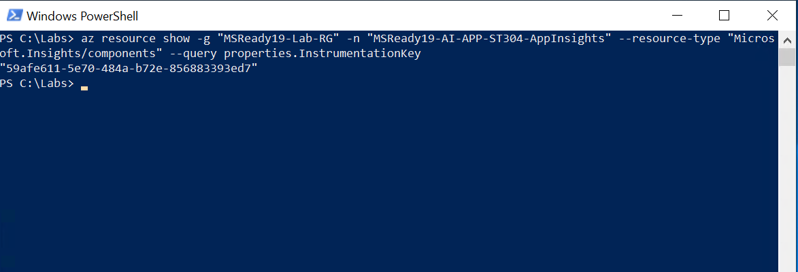
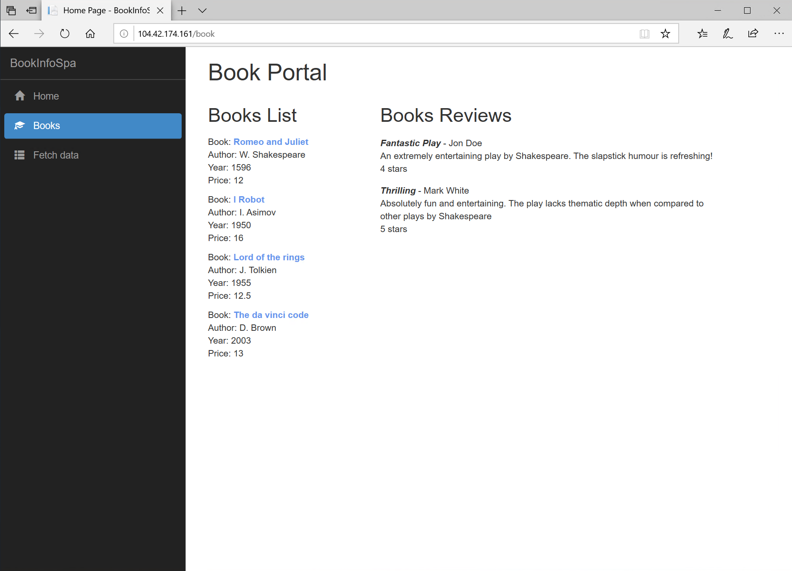

# Lab Setup - Confirm the app is running

## 1. Clone the AI-APP-ST304 Lab Git repo

1. Start a PowerShell session
2. Create the directory that will be the main Lab working folder by executing

   ```powershell
   mkdir C:\Labs
   ```

3. Change directory to the Lab working folder by executing

   ```powershell
   cd c:\Labs
   ```

4. Clone the official lab Git repo by executing  

   ```powershell
   git clone https://github.com/MikeCer/MSReady19-AI-APP-ST304.git
   ```

## 2. Create a resource group

1. Sign-In interactively trough your browser with the _az login_ command; after signing in, CLI commands are run against your default subscription
    1. Run the _login_ command  
         ```azurecli-interactive
        az login
        ```
        If the CLI can open your default browser, it will do so and load a sign-in page.
        Otherwise, you need to open a browser page and follow the instructions on the command line to enter an authorization code after navigating to https://aka.ms/devicelogin in your browser.
    2. Sign in with your account lab (cloud slice) credentials in the browser
    3. Verify that the authenticated session has been correctly established checking the JSON structure returned that needs to contain your subscriptions information  
        ``` json
        [
            {
                "cloudName": "AzureCloud",
                "id": "cf1526b4-c3e0-4ce8-8782-686db66a4347",
                "isDefault": true,
                "name": "MySubscription",
                "state": "Enabled",
                "tenantId": "675e22fe-b1b0-4b37-86c3-b491ab7a1431",
                "user": {
                    "name": "username@contoso.com",
                    "type": "user"
                }
            }
        ]
        ```
        Same output can be obtained by executing the command

         ```azurecli-interactive
        az account list
        ```

2. Create the resource group by executing the command  
    ```azurecli-interactive
    az group create -l westus -n MSReady19-Lab-RG
    ```
    that will create a new RG named MSReady19-Lab-RG using West US region in your default subscription.  
    The command will return a JSON structure like the following, indicating that the new RG has been successfully created.
    ``` json
    {
        "id": "/subscriptions/cf1526b4-c3e0-4ce8-8782-686db66a4347/resourceGroups/MSReady19-Lab-RG",
        "location": "westus",
        "managedBy": null,
        "name": "MSReady19-Lab-RG",
        "properties": {
            "provisioningState": "Succeeded"
        },
        "tags": null
    }
    ```

## 3. Create the Application Insights resource

1. Prepare $_prop_ and $_propJson_ Powershell variables by executing the following two commands:

   ```powershell
     $prop = '{"ApplicationId":"MSReady19-AI-APP-ST304-AppInsights","Application_Type":"other","Flow_Type":"Redfield","Request_Source":"IbizaAIExtension"}'  

     $propJson = $prop | ConvertTo-Json
   ```

2. Create the resource using the Azure CLI _resource create_ command

    ```powershell
    az resource create --resource-group "MSReady19-Lab-RG" --resource-type "Microsoft.Insights/components" --name "MSReady19-AI-APP-ST304-AppInsights" --location "westus2" --properties $propJson
    ```

    after the execution completion, the output will show a JSON object similar to this

    ```json
    {
        "etag": "\"9400df73-0000-0000-0000-5c278ebb0000\"",
        "id": "/subscriptions/adef826a-7ef0-4705-b52c-708e062c03d1/resourceGroups/MSReady19-Lab-RG/providers/microsoft.insights/components/MSReady19-AI-APP-ST304-AppInsights",
        "identity": null,
        "kind": "other",
        "location": "westus2",
        "managedBy": null,
        "name": "MSReady19-AI-APP-ST304-AppInsights",
        "plan": null,
        "properties": {
            "AppId": "9f581c23-307b-48a4-a44c-2505cb620f8d",
            "ApplicationId": "MSReady19-AI-APP-ST304-AppInsights",
            "Application_Type": "other",
            "CreationDate": "2018-12-29T15:11:54.4734986+00:00",
            "CustomMetricsOptedInType": null,
            "Flow_Type": "Redfield",
            "HockeyAppId": null,
            "HockeyAppToken": null,
            "InstrumentationKey": "59afe611-5e70-484a-b72e-856883393ed7", //<- take note of this value
            "Name": "MSReady19-AI-APP-ST304-AppInsights",
            "PackageId": null,
            "Request_Source": "IbizaAIExtension",
            "SamplingPercentage": null,
            "TenantId": "adef826a-7ef0-4705-b52c-708e062c03d1",
            "Ver": "v2",
            "provisioningState": "Succeeded"
        },
        "resourceGroup": "MSReady19-Lab-RG",
        "sku": null,
        "tags": {},
        "type": "microsoft.insights/components"
    }
    ```

    where the value of the property _provisioningState_ indicates that the AppInsights workspace has been successfully provisioned.

## 4. Create the Azure Kubernetes Service Lab cluster

The AKS cluster and all the related resources will be deployed directly using the Azure CLI.

1. Execute the following command

    ```azurecli-interactive
    az aks create -g "MSReady19-Lab-RG" -n "MSReady19-AI-APP-ST304-AKS" --node-count 1 --generate-ssh-keys --kubernetes-version 1.9.11 --verbose
    ```

    that will automatically submit a deployment job in order to spin-up the AKS resource within the group previously created and then create the reserved resource group for all the components belonging to the managed Kubernetes infrastructure.

    After the execution completion, the output will show a JSON object similar to this:

    ```json
    {
        "aadProfile": null,
        "addonProfiles": null,
        "agentPoolProfiles": [
            {
            "count": 1,
            "maxPods": 110,
            "name": "nodepool1",
            "osDiskSizeGb": 30,
            "osType": "Linux",
            "storageProfile": "ManagedDisks",
            "vmSize": "Standard_DS2_v2",
            "vnetSubnetId": null
            }
        ],
        "dnsPrefix": "MSReady19--MSReady19-Lab-RG-adef82",
        "enableRbac": true,
        "fqdn": "msready19--msready19-lab-rg-adef82-2a5df105.hcp.westus.azmk8s.io",
        "id": "/subscriptions/adef826a-7ef0-4705-b52c-708e062c03d1/resourcegroups/MSReady19-Lab-RG/providers/Microsoft.ContainerService/managedClusters/MSReady19-AI-APP-ST304-AKS",
        "kubernetesVersion": "1.9.11",
        "linuxProfile": {
            "adminUsername": "azureuser",
            "ssh": {
            "publicKeys": [
                {
                "keyData": "ssh-rsa AAAAB3NzaC1yc2EAAAADAQABAAABAQC4KvfsVSzGeT779+4wv2jPHt07FYRt9I+M9kXDPfbCvDgVgA3B1lcssJioJ8oCrpYX9gZACCyNl9RgI9jTbqn+JZ0bepfzurer84Fa/dFHOR6pdGJtgya7qQpLyl+sCxPEFm2v2v8KBuWRKB9N9GsTyvOQOZoSIIxkA29vtDMbSJ1UBh1g/H7Zv7w54hhxMdEFTEL2q6ht7pvx8Ppd9Heda7P8HYWDB1z8pB3WgRHIN9jZ3bHezqLHJ9oDq/FCj80ZMEvoWEDJivoLFRHhKFi1q66yQ3Ri2YNOYSQcE76NGB/v7JmmiB0h9i7lrW/jg13kgfVPO0XfE22CbwMrpM6f"
                }
            ]
            }
        },
        "location": "westus",
        "name": "MSReady19-AI-APP-ST304-AKS",
        "networkProfile": {
            "dnsServiceIp": "10.0.0.10",
            "dockerBridgeCidr": "172.17.0.1/16",
            "networkPlugin": "kubenet",
            "networkPolicy": null,
            "podCidr": "10.244.0.0/16",
            "serviceCidr": "10.0.0.0/16"
        },
        "nodeResourceGroup": "MC_MSReady19-Lab-RG_MSReady19-AI-APP-ST304-AKS_westus",
        "provisioningState": "Succeeded",
        "resourceGroup": "MSReady19-Lab-RG",
        "servicePrincipalProfile": {
            "clientId": "6a948472-5d33-4826-95e4-1e66f0d40bca",
            "secret": null
        },
        "tags": null,
        "type": "Microsoft.ContainerService/ManagedClusters"
    }
    ```

    that reports a bunch of useful information like the _fqdn_ value of the cluster, the network profile, the size and the OS profile of the VMs which are composing the cluster.

2. In order to verify that your AKS is up & running, you need to use _kubectl_ tool, but first you have to get the credentials for your cluster by running the following command:

    ```dos
    az aks get-credentials --resource-group MSReady19-Lab-RG --name MSReady19-AI-APP-ST304-AKS
    ```

    Azure CLI will merge the references of the newly created AKS cluster with the local _kubectl_ configuration  

    

3. Get the nodes list using  _kubectl_ by executing the following command

    ```dos
    kubectl get nodes 
    ```

    that will show that our single-node AKS cluster is successfully running

    

## 5. Get the Application Insights Instrumentation Key

The lab makes use of Application Insights to get and analyze different metrics of the applications deployed within the AKS cluster.  
After you have created the resource, you get its instrumentation key and use that to configure the SDK in the applications. The resource key links the telemetry to the resource.  
In the previous lab, by executing the step 3, you have already created the Application Insights workspace; now we can obtain the instrumentation key using Azure CLI.

1. Execute the following command:

    ```azurecli-interactive
    az resource show -g "MSReady19-Lab-RG" -n "MSReady19-AI-APP-ST304-AppInsights" --resource-type "Microsoft.Insights/components" --query properties.InstrumentationKey
    ```

    the output will be similar to this:

    

2. Take note of the GUID reported in the execution output of the previous command

## 6. Add the Instrumentation Key to the K8S secret file

A Secret is an object that contains a small amount of sensitive data such as a password, a token, or a key. Such information might otherwise be put in a Pod specification or in an image; putting it in a Secret object allows for more control over how it is used, and reduces the risk of accidental exposure.

All the .NET Core applications included in this Lab will reference the Instrumentation Key in order to be able to push telemetry data into the Application Insights workspace. The key is obtained by reading an enviroment variable, present within the POD env, that is directly bound to a secret in the k8s service creation phase.

All the K8S deployment files that you will use in the next few steps contains a strict reference to a Kubernetes secret that needs to be already created within the cluster.

So, let's proceed to edit the secret yaml file:

1. Open the k8s secret file in VS Code by executing in the PowerShell the following command:

    ```dos
    code C:\Labs\K8sConfigurations\secrets\instrumentationkey.yaml
    ```

2. Add the key, obtained in the previous step, to the _instrumentationkey_ yaml property, as shown in the following images

    

    in order to have the following final result

     

3. Save the edited file by using Ctrl+S shortcut or File->Save menu item, then close VS Code

## 7. Create the secret using the k8s yaml file

The secret key will be created within the cluster using the _kubectl_ CLI

1. Execute the following command and wait for the execution

    ```dos
    kubectl create -f C:\Labs\K8sConfigurations\secrets\instrumentationkey.yaml
    ```

    the output will be:

    ```dos
    secret/appinsightskey created
    ```
2. Double check the presence of the secret by executing the following command:

    ```dos
    kubectl get secrets
    ```

    that will return an output similar to this:

    ```plain
    NAME                  TYPE                                  DATA   AGE
    appinsightskey        Opaque                                1      92m
    default-token-d9qrw   kubernetes.io/service-account-token   3      164m
    ```

## 8. Deploy the Book Service V1

1. Deploy the Book Service Web API using _/k8sconfigurations/default/bookservice-v1.yaml_ file trought _kubectl_ CLI, by executing:

    ```dos
    kubectl create -f C:\Labs\K8sConfigurations\default\bookservice-V1.yaml
    ```

    that will return an output similar to this:

    ```dos
    deployment.apps/bookservice created
    service/bookservice created
    ```

2. Wait few minutes and then check if the BookService _pod_ is correctly running by executing:

    ```dos
    kubectl get pods
    ```

    that will return an output similar to this:

    ```plain
    NAME                           READY   STATUS    RESTARTS   AGE
    bookservice-5bdd9968b5-trrxx   1/1     Running   0          11s
    ```

    indicating _running_ as current status.

3. Check if the BookService _service_ is correctly configured and a cluster IP has been successfully assigned by executing:

    ```dos
    kubectl get service
    ```

    that will return an output similar to the following:

    ```plain
    NAME          TYPE        CLUSTER-IP    EXTERNAL-IP   PORT(S)   AGE
    bookservice   ClusterIP   10.0.98.140   <none>        80/TCP    23s
    kubernetes    ClusterIP   10.0.0.1      <none>        443/TCP   20h
    ```

## 9. Deploy the BookInfo SPA

1. Deploy the BookInfo Single Page Application using _/k8sconfigurations/default/bookinfo-spa.yaml_ file trought _kubectl_ CLI, by executing:

    ```dos
    kubectl create -f C:\Labs\K8sConfigurations\default\bookinfo-spa.yaml
    ```

    that will return an output similar to this:

    ```plain
    deployment.apps/bookinfo-spa created
    service/bookinfo-spa created
    ```

2. As the deployment file, the pods related to the BookInfo SPA needs to have 2 replicas, so we need to check if both replicas are currently running by executing:

    ```dos
    kubectl get pods
    ```

    that will return an output similar to this:

    ```plain
    NAME                            READY   STATUS    RESTARTS   AGE
    bookinfo-spa-57bdd84f98-8jmm9   2/2     Running   0          44s
    bookservice-5bdd9968b5-trrxx    1/1     Running   0          28m
    ```

    indicating that 2 of 2 replicas are have status as _running_

3. Since, we need to expose the Web Application to external users, BookInfo SPA deployment file also contains the definition for a _LoadBalancer_ k8s service that provides the configuration of an external IP that will be used to reach the sidecar proxy and then the web application. You can check the service status and retrieve the external IP by executing:

    ```dos
    kubectl get service
    ```

    that will return an output similar to this:

    ```plain
    NAME           TYPE           CLUSTER-IP    EXTERNAL-IP      PORT(S)        AGE
    bookinfo-spa   LoadBalancer   10.0.75.9     104.42.174.161   80:30654/TCP   7m4s
    bookservice    ClusterIP      10.0.98.140   <none>           80/TCP         35m
    kubernetes     ClusterIP      10.0.0.1      <none>           443/TCP        20h
    ```

    reporting, in that case, _104.42.174.161_ as the public IP you should use.

## 10. Check the BookInfo SPA using the browser

1. Open Edge Browser;

2. Open the URL http://\[**EXTERNAL_IP_PLACEHOLDER**\] replacing the placeholder with the public ip obtained in the previous step, then the home page of the single page application will be shown

    

3. Click on the **Books** menu item at left to open the Books portal functionality

    

    If you are able to successfully see the book list and the related reviews, you can confirm that also the BookService API is working correctly.

4. Make some clicks on bookitem in order to generate some HTTP traffic between the SPA and the Web API.

## 11. Check if telemetry is present on AppInsights

1. Open Edge Browser;
2. Open Azure Portal at https://portal.azure.com;
3. Sign-In using Cloud Slice credential provided within this Lab;
4. Browse all Resource Groups by click on _Resource groups_ menu item on the left bar;
5. You should see the two resource groups created in the Lab 1, as the following screenshot shows:

    

6. Click on the RG named _MSReady19-Lab-RG_;
7. Access to the Application Insights resource by clicking on _MSReady19-AI-APP-ST304-AppInsights_

    

8. Click on _Analytics_ button to access the custom query editor

    

9. Type the following query

    ```loganalytics
    requests
     | where resultCode == 200
    ```

    into the query editor as shown in the following screenshot

    

    in order to retrieve info on requests with 200 result code handled in the last 24h;

10. Click on _Run_ button, then you should see the results

      
    _(Please expect few differences in number between your query results and the above image)_

    indicating that the telemetry is correctly working.