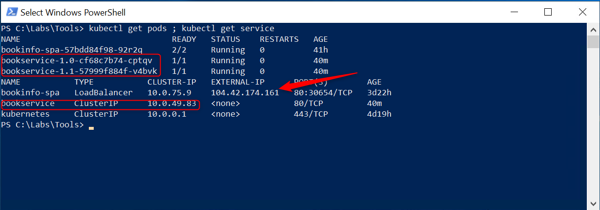
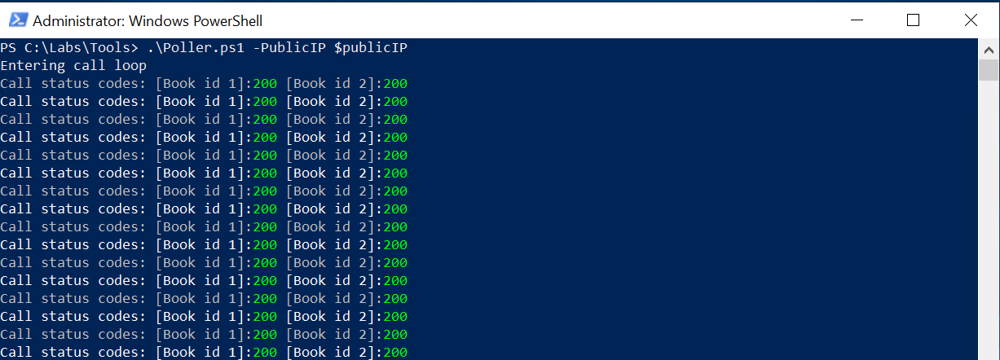
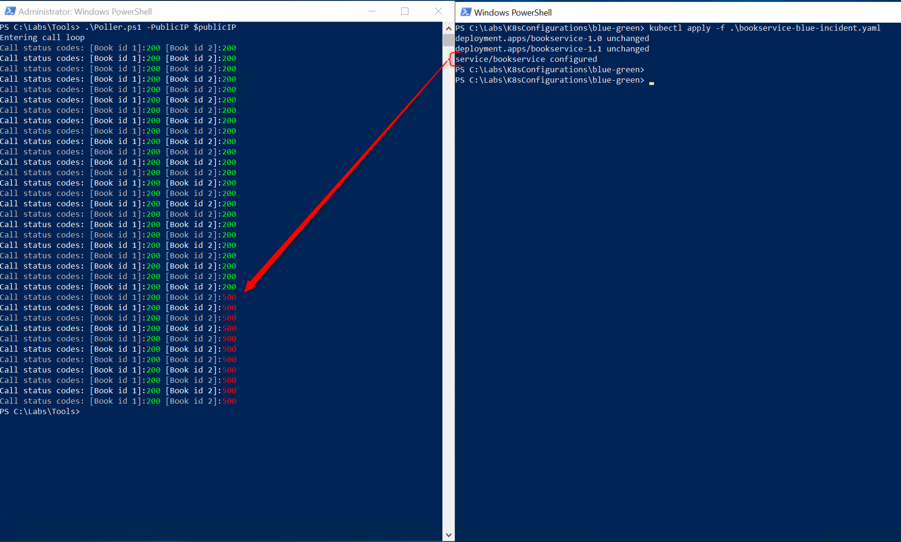

# Blue/Green Deployments

## 1. Clean-up existing BookService deployment

1. Start a PowerShell session and remove existing _bookservice_ deployment and service trought _kubectl_ by executing the following commands:

    ```dos
    kubectl delete deployment bookservice ; kubectl delete service bookservice
    ```

    that will return

    ```plain
    deployment.extensions "bookservice" deleted
    service "bookservice" deleted
    ```

2. Double check the results of the delete operation by executing:

    ```dos
    kubectl get pod; kubectl get service
    ```

    that confirm the lack of references to the _bookservice_ pods and service

    ```plain
    NAME                            READY   STATUS    RESTARTS   AGE
    bookinfo-spa-57bdd84f98-92r2q   2/2     Running   0          39m
    NAME           TYPE           CLUSTER-IP   EXTERNAL-IP      PORT(S)        AGE
    bookinfo-spa   LoadBalancer   10.0.75.9    104.42.174.161   80:30654/TCP   2d5h
    kubernetes     ClusterIP      10.0.0.1     <none>           443/TCP        3d2h
    ```

## 2. Deploy the BookService (Blue \ Green) and set the Live Environment to Green

1. Execute the following command

   ```dos
    kubectl apply -f C:\Labs\k8sconfigurations\blue-green\bookservice-green-ok.yaml
   ```

   that will return

   ```plain
    deployment.apps/bookservice-1.0 created
    deployment.apps/bookservice-1.1 created
    service/bookservice created
   ```

2. Double check the results of the _apply_ operation by executing:

     ```dos
    kubectl get pod ; kubectl get service
    ```

    that confirms the creation of the k8s clusterIP service and the two k8s pods _bookservice-1.0_ (our production environment - green) and _bookservice-1.1_ (our staging enviroment - blue)

    

3. Set the PowerShell $publicIP variable to the external IP reported by _kubectl_ by executing, in that case:

   	```powershell
    $publicIP = "104.42.174.161"
    ```

    The $publicIP variable will be used in the next few steps as an input parameter to the _poller.ps1_ script

## 3. Generate HTTP requests vs the BookService API

At this point we need to generate some HTTP traffic versus the BookService API using the _poller.ps1_ PowerShell script in order to highlight the effects of the blue \ green deployment strategy once we proceed to execute the swap between green and blue version

1. Start PowerShell as admin and execute the following command to allow the execution of the _poller.ps1_ script

    ```powershell
    Set-ExecutionPolicy Unrestricted
    ```

    as the following screenshot

    

2. Run the _poller.ps1_ script that basically makes two requests on the BookService WebAPI, first calling the /reviews/1 (the reviews of the Book with ID 1) then the /review/2 endpoint (all the reviews of the Book with ID 2), by executing:

    ```powershell
    C:\Labs\Tools\Poller.ps1 -PublicIP $publicIP
    ```

    As you can see below  

    

    the script runs a loop that provides two requests each seconds until you terminates it using _Ctrl+C_ shortcut

    Don't terminate the script, so you can easily view the effects of the blue version deployment in the next steps.

## 4. Switch the Live Environment to Blue (which contains a fault)

The blue version of the BookService API contains an exception raised while loading reviews for the BookId = 2 in order to simulate a fault in the codebase.

1. Start a new PowerShell session and then proceed to deploy the Blue version of the BookService API, by executing:

    ```powershell
    kubectl apply -f C:\Labs\K8sconfigurations\blue-green\bookservice-blue-incident.yaml
    ```

    As you can see below, while the _poller.ps1_ was continuing to receive HTTP 200 (OK status - the request has succeeded), as soon as the deployment procedure has been completed and then the _service/bookservice_ swapped from a cluster IP to another one, the script started to receive HTTP 500 (Internal Server Error status - the server encountered an unexpected condition that prevented it from fulfilling the reques) as final status code, indicating a fault

    

    So, it's quite easy to understand that Blue\Green deployment strategy is very useful to reduce\remove deployment downtime providing also, thanks to the k8s infrastructure, an easy rollback operation in terms of effort, but finally that cannot prevent to bring "broken" code on production environment causing a service outage for our final users.

## 5. Rolling back to the healthy version (Green)

Looking at the two deployment files _C:\Labs\k8sconfigurations\blue-green\bookservice-green-OK.yaml_ and _C:\Labs\k8sconfigurations\blue-green\_bookservice-blue-incident.yaml_ we could spot that the main difference, apart from the different Docker images of the containers and version tag label, is the *selector* of the service.

K8s use selectors to basically bind a service, so in our case a Cluster IP, to a deployment.

In our green deployment yaml file the service named _bookservice_ is defined as above:

```yaml
apiVersion: v1
kind: Service
metadata:
  name: bookservice
spec:
  ports:
  - port: 80
  selector:
    app: bookservice
    deployment: green
```

where the _deployment_ property allows k8s to bind the service to the green deployment of the bookservice app, while,instead, in the blue yaml file the selector is:

```yaml
apiVersion: v1
kind: Service
metadata:
  name: bookservice
spec:
  ports:
  - port: 80
  selector:
    app: bookservice
    deployment: blue
```

So, switching between the faulty and healthy version consists in changing the _deployment_ property value of the selector, replacing the _spec_ structure

You can achieve that step, trought _kubectl_, by executing the following commands:

1. Start the _poller.ps1_ script to monitor the response code received from the BookService API, by executing:

    ```powershell
    C:\Lab\Tools\Poller.ps1 -PublicIP $publicIP
    ```

2. Use the other PowerShell session to prepare the new $_spec_ and $_specJson_ variables by executing the following two commands:

   ```powershell
    $spec = '{"spec":{"selector":{"deployment":"green"}}}'  

    $specJson = $spec | ConvertTo-Json
   ```

   then execute _kubectl_ _patch_ command, passing the Json variable as input parameter to the _-p_ switch:

   ```powershell
   kubectl patch service bookservice -p $specJson
   ```

   As you can see in the following screenshot:

   

   as soon as k8s complete the patch operation, the BookService API started to send HTTP 200 (Status OK) for the request related to the BookId = 2.