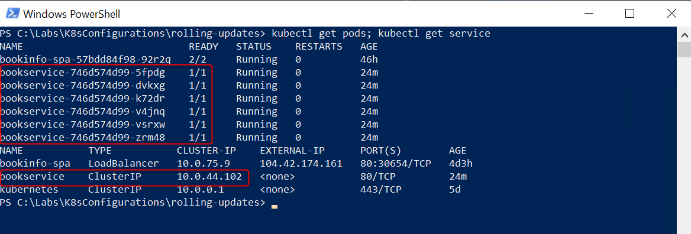
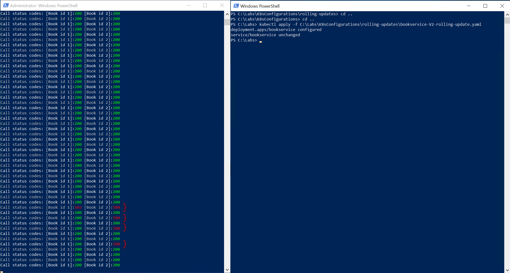
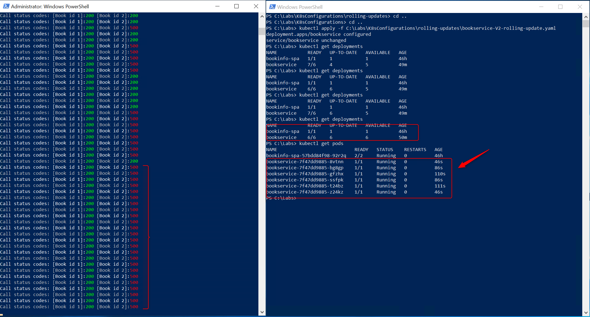
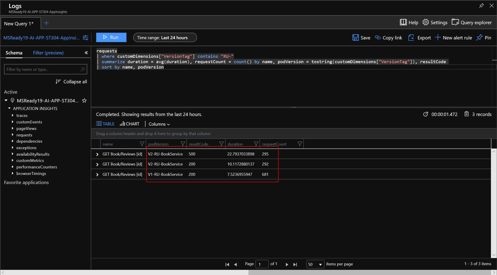

# Rolling Updates deployment

## 1. Clean-up existing BookService deployment

1. Start a PowerShell session and remove existing _bookservice_ deployments and service trought _kubectl_ by executing the following commands:

    ```plain
    kubectl delete deployment bookservice-1.0 bookservice-1.1 ; kubectl delete service bookservice
    ```

    that will return

    ```plain
    deployment.extensions "bookservice-1.0" deleted
    deployment.extensions "bookservice-1.1" deleted
    service "bookservice" deleted
    ```

2. Double check the results of the delete operation by executing:

    ```dos
    kubectl get pod; kubectl get service
    ```

    that confirm the lack of references to the _bookservice_ pods and service

    ```plain
    NAME                            READY   STATUS    RESTARTS   AGE
    bookinfo-spa-57bdd84f98-92r2q   2/2     Running   0          39m
    NAME           TYPE           CLUSTER-IP   EXTERNAL-IP      PORT(S)        AGE
    bookinfo-spa   LoadBalancer   10.0.75.9    104.42.174.161   80:30654/TCP   2d5h
    kubernetes     ClusterIP      10.0.0.1     <none>           443/TCP        3d2h
    ```

## 2. Deploy the BookService API

1. Re-deploy the original BookService API by executing:

    ```dos
    kubectl apply -f C:\Labs\k8sconfigurations\rolling-updates\bookservice-V1-reduntant.yaml
    ```

    that will return an output similar to this:

    ```dos
    deployment.apps/bookservice created
    service/bookservice created
    ```

2. Double check the result of the apply operation by executing:

     ```dos
    kubectl get pods; kubectl get service
    ```

    that will clearly shows the presence of 6 replicas of the BookService and the ClusterIP service as usual

    

## 3. Execute the Poller script

1. Execute the _poller_ script or use the web application to get some traffic for the BookService API. From the folder _C:\Labs\Tools_ runs

    ```powershell
   .\Poller.ps1 -PublicIP $publicIP
    ```

    in order to see how the BookService API correctly returns HTTP 200 for the Book ID 2 reviews

    

## 4. Deploy BookService using Rolling Updates strategy

1. While the _poller_ script is running, open a new PowerShell session and deploy the BookService API using the rolling updates strategy by executing

   ```dos
   kubectl apply -f C:\Labs\K8sConfigurations\rolling-updates\bookservice-V2-rolling-update.yaml
   ```

   that returns

   ```plain
   deployment.apps/bookservice configured
   service/bookservice unchanged
   ```

2. Let's monitor the PowerShell session where _poller_ script is running, you'll start to see some fails for the  [BookId 2] HTTP call

    

    The number of fails will increase accordingly to the rolling-update strategy parameters we have decided to set and until all the replicas will became update & ready

    

    As the screenshot, you can use

    ```dos
    kubectl get deployments
    ```

    to monitor the deployment status and

    ```dos
    kubectl get pods
    ```

    to get the aging of your replica pod that represents a clear indication of when the instance has been restarted to consolidate the update.

3. You can use Application Insight and Log Analytics to monitor the number of failed request generated by the BookService version deployed using the rolling-updates strategy.

   Wait a couple of minutes, needed for Azure Application Insights to collect telemetry, and paste the content of the "_LogAnalyticsQuery.md_" file into Azure Log Analytics.

    ```plain
    requests
    | where customDimensions["VersionTag"] contains "RU-"
    | summarize duration = avg(duration), requestCount = count() by name, podVersion = tostring(customDimensions["VersionTag"]), resultCode 
    | sort by name, podVersion
    ```

    Then hit "Run" query and you should get something similar to the following image:

    

    where the difference between the "**V1-RU-BookService**" and the "**V2-RU-BookService**" in terms of result code counters are well highlighted